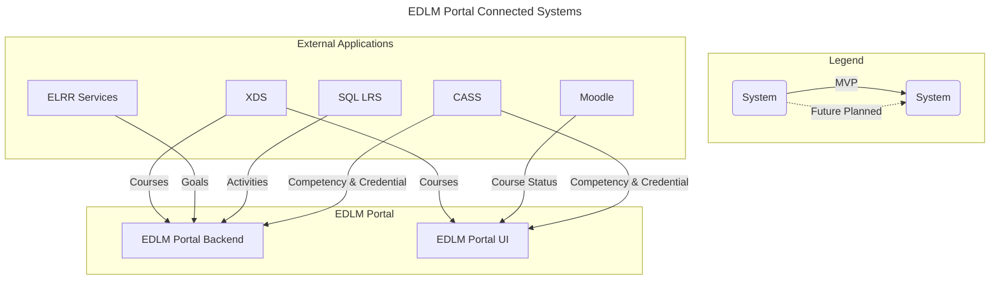

# Enterprise Digital Learning Management: Portal-Backend
The Enterprise Digital Learning Management (EDLM) Portal Backend is the consolidated backend to the human-facing Portal UI application, enabling complex data processing across multiple data sources. Because the Portal Backend is a separate application, it can be deployed in a separate environment from the connected services. It can even be configured to point to different deployments (ECC, ELRR, ECCR, Moodle, etc.) as needed. In addition, multiple Portal Backend applications can be deployed and point to the same instances, allowing for excellent installation and configuration flexibility. 

## EDLM Portal System Architecture

## Environment variables
- The following environment variables are required:

| Environment Variable               | Description                                                                                                                                                                                                                                        |
| ---------------------------------- | -------------------------------------------------------------------------------------------------------------------------------------------------------------------------------------------------------------------------------------------------- |
| CORS_ALLOWED_CREDENTIALS           | Specifies if the server should allow credential requests                                                                                                                                                                                           |
| CORS_ALLOWED_ORIGINS               | A list of allowed origins for safe requests                                                                                                                                                                                                        |
| CSRF_COOKIE_DOMAIN                 | The domain to be used when setting the CSRF cookie. This can be useful for easily allowing cross-subdomain requests to be excluded from the normal cross site request forgery protection.                                                          |
| CSRF_TRUSTED_ORIGINS               | A list of trusted origins for unsafe requests                                                                                                                                                                                                      |
| DB_HOST                            | The host name, IP, or docker container name of the database                                                                                                                                                                                        |
| DB_NAME                            | The name to give the database                                                                                                                                                                                                                      |
| DB_PASSWORD                        | The password for the user to access the database                                                                                                                                                                                                   |
| DB_PORT                            | The port to use to access the database                                                                                                                                                                                                             |
| DB_USER                            | The name of the user to use when connecting to the database. When testing use root to allow the creation of a test database                                                                                                                        |
| DJANGO_SUPERUSER_EMAIL             | (OPTIONAL) The email of the superuser that will be created in the application                                                                                                                                                                      |
| DJANGO_SUPERUSER_PASSWORD          | (OPTIONAL) The password of the superuser that will be created in the application                                                                                                                                                                   |
| DJANGO_SUPERUSER_USERNAME          | (OPTIONAL) The username of the superuser that will be created in the application                                                                                                                                                                   |
| FORCE_SCRIPT_NAME                  | (OPTIONAL) The path prefix to use for routing of requests                                                                                                                                                                                          |
| HOSTS                              | A list of host names, separated by semicolons, that the application should accept requests for                                                                                                                                                     |
| LOG_PATH                           | The path to the log file to use                                                                                                                                                                                                                    |
| SECRET_KEY_VAL                     | The Secret Key for Django                                                                                                                                                                                                                          |
| XAPI_USE_JWT                       | If this variable is set, attempt to use the value of a JWT auth token to derive the xAPI actor account. If not set the actor will be identified by mbox email                                                                                      |
| XAPI_ACTOR_ACCOUNT_HOMEPAGE        | Set the `$.actor.account.homePage` field on xAPI Statements. Only used when `XAPI_USE_JWT` is `true`                                                                                                                                               |
| XAPI_ACTOR_ACCOUNT_NAME_JWT_FIELDS | A comma-separated list of fields to check in the JWT for the `$.actor.account.name` field on xAPI Statements. The first non-empty string found will be chosen. Defaults to `activecac,preferred_username`. Only used when `XAPI_USE_JWT` is `true` |

## Configuration for EDLM Portal Backend

1. After running `docker compose up -d --build`, navigate over to `http://localhost:8100/admin/` in your browser and login to the Django Admin page with the admin credentials set in your `.env`(`DJANGO_SUPERUSER_EMAIL` & `DJANGO_SUPERUSER_PASSWORD`)

2. Once you have logged in, you can see that you have access to three different configuration options: Admin configurations, Configurations, and UI configurations. The site must be properly configured with API endpoints to enable sharing course data.

3.  Add Configuration - This configuration allows you to set up base connections and add yourself to Manager groups or Admin groups in the organization. **If a user is in a group that is configured to be a Manager or Admin, then it sets a flag on their account that can be checked via API so that the UI can change based on the role that user has.**

    - Enter the XDS, ELRR, and ECCR endpoints you wish to query. These are the target URLs of the individual service APIs, and the `Target api` in bold are required to save the configuration.
        
    - Under `Manager Connections` and `Organization Admin Connections`, you can configure Manager and Organization Admin groups, and the configuration API will return different information depending on if the current user is in any of those groups, or has been added to any Admin Configs.
        
    - You can also configure your account to send data to LRS, but filling out the LRS settings is optional.

4. Add Admin Configuration - Admin Configurations allows setting a `Name` and `Target` URL and then uses object-level permissions to allow the UI to access additional configurations that only certain users have access to.

5. Ui Configurations - This configuration allows the user to set UI visuals for the EDLM Portal, such as displaying a welcome message when other users log into the site.
    * Click on `UI configurations` > `Add UI configuration`

    * Fill out the Portal Name and Welcome Message you wish to be displayed.

    * A logo image must also be provided. It must be an image file type to display.

    * There can only be one Ui Configuration instance - if you wish to set a new UI, you can click on the `PK` column header and in the right corner of the configuration screen there will be a `Delete` button. 

 Troubleshooting the EDLM Portal Backend

A good basic troubleshooting step is to use `docker-compose down` and then `docker-compose up --build` to rebuild the app image; however, this will delete everything in the database.

| Troubleshooting | Description                                                                                                                                                                                                                                                                                                        |
| --------------- | ------------------------------------------------------------------------------------------------------------------------------------------------------------------------------------------------------------------------------------------------------------------------------------------------------------------ |
| Line Endings    | If the container builds but crashes or logs an error of unrecognized commands, the issue is usually incorrect line endings.    Most IDEs/Text Editors allow changing the line endings, but the dos2unix utility can also be used to change the line endings of `start-app.sh` and `start-server.sh` to LF. |

 Updating the EDLM Portal Backend

To update an existing installation: 

1. Pull the latest changes using git

2. Restart the application using `docker-compose restart`

 EDLM Portal Backend Authentication 

Information on the settings for the authentication module can be found on the [P1-Auth repo](https://github.com/OpenLXP/p1-auth) and [django-rest-knox documentation](https://jazzband.github.io/django-rest-knox/).

 ECC XDS Authorization

The environment variables `SU_FLAG`, `SU_VALUE` , `STAFF_FLAG`, and `STAFF_VALUE` should be defined (if using docker-compose the variables can be passed through) to automate Staff and Super User access.

Additional permission automation can be done using `RelatedAssignment` and `AttributeCheck` within the Django Admin.

# Deployment
The EDLM Portal Backend is deployed using Docker containers. Docker containers are portable, scalable, and reliable. EDLM Docker images will be stored in the public IronBank's Repo1 registry to allow anyone to pull and deploy the image. Docker images are also cloud agnostic which allows for deployment on any cloud provider. Images can be deployed as a single Docker image, a cloud provided container service, and Kubernetes for orchestration. The EDLM deploys component images on Kubernetes to orchestrate containers for scalability, reliability, and high availability.

## Testing

### Component Testing & CI/CD

The EDLM Portal Backend uses Pylint and Coverage for code coverage testing. To run the automated tests on the application run the command below

### End to End Testing

The EDLM Portal Backend uses cypress for system end to end testing. Cypress documentation can be found [here](https://docs.cypress.io/app/get-started/why-cypress).

### Authorization

Using Django's Admin system, permissions can be applied to a specific user or group. We use  [djangorestframework-guardian2](https://pypi.org/project/djangorestframework-guardian2/) for object-level permissions, and more information about editing these permissions can be found [here](https://docs.djangoproject.com/en/6.0/topics/auth/customizing/).